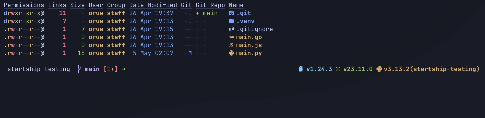

## My ZSH Configuration

This is my personal ZSH configuration, which includes various customizations, aliases, and functions to enhance the ZSH shell experience.

I use [Ghostty](http://ghostty.com), which is a terminal emulator that supports ZSH and provides a modern interface with
Tokyo night color scheme. The configuration is designed to work seamlessly with Ghostty, but it can also be used in other terminal emulators.

### Screenshots
Here are some screenshots of the ZSH configuration in action:


### Installation

Run the following commands in your terminal to point to ZSH configuration on .config/zsh:

```sh
echo ZDOTDIR=$HOME/.config/zsh > ~/.zshenv
```

Then, clone this repository into the `.config/zsh` directory:

```sh
git clone https://github.com/orue/zsh-settings.git
```
After cloning, your `.config/zsh` directory should look like this:

```sh
.config/zsh
├── .gitignore
├── .zshrc
├── aliases.zsh
├── aws.zsh
├── exports.zsh
├── functions.zsh
├── git-aliases.zsh
├── nvm.zsh
├── python-venv.zsh
├── README.md
├── starship.toml
├── transient-prompt.zsh
├── user-aliases.zsh
└── variables.zsh
```
