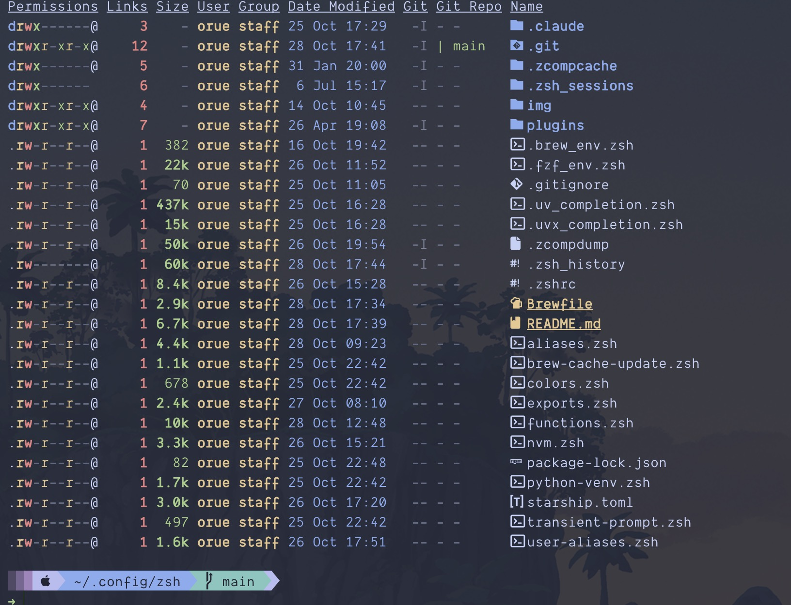

# My ZSH Configuration

A modern, feature-rich ZSH configuration optimized for development workflows with Git, Node.js, and Python support.

## Table of Contents
- [Features](#features)
- [Screenshots](#screenshots)
- [Prerequisites](#prerequisites)
- [Installation](#installation)
- [Usage Examples](#usage-examples)
- [File Structure](#file-structure)
- [Troubleshooting](#troubleshooting)
- [Uninstall](#uninstall)
- [Contributing](#contributing)
- [License](#license)

## Features

- **Starship Prompt**: Fast, customizable prompt with Git status and environment info
- **Git Enhancements**: Useful Git aliases and functions
- **Node.js Support**: NVM integration for Node version management
- **Python Environment**: Virtual environment management and shortcuts
- **Smart Aliases**: Productivity-boosting command shortcuts
- **Plugin Management**: Easy plugin updates and management
- **Ghostty Optimized**: Designed for [Ghostty terminal](http://ghostty.com) with Tokyo Night theme

## Screenshots



## Prerequisites

Before installation, ensure you have:

- **ZSH shell** (version 5.0+)
- **Git** for cloning the repository
- **[Starship prompt](https://starship.rs/)** (recommended)
- **Ghostty terminal** (optional, works with any terminal)

Install Starship:
```sh
curl -sS https://starship.rs/install.sh | sh
```

## Installation

1. Set ZSH configuration directory:
```sh
echo 'ZDOTDIR=$HOME/.config/zsh' > ~/.zshenv
```

2. Clone this repository:
```sh
git clone https://github.com/orue/zsh-settings.git ~/.config/zsh
```

3. Restart your terminal or run:
```sh
exec zsh
```

## Usage Examples

### Key Aliases
```sh
# Quick config editing
zshrc                    # Edit .zshrc with nvim

# Password generation
gpass                    # Generate secure 20-char password

# Plugin management
zsh-update-plugins       # Update all ZSH plugins
```

### Useful Functions
```sh
reload                   # Reload ZSH configuration
fzf_edit                 # Fuzzy find and edit files
```

## File Structure

```
.config/zsh/
├── .gitignore           # Git ignore patterns
├── .zshrc              # Main ZSH configuration
├── aliases.zsh         # General aliases
├── exports.zsh         # Environment exports
├── functions.zsh       # Custom functions
├── nvm.zsh             # Node Version Manager setup
├── python-venv.zsh     # Python virtual environment tools
├── starship.toml       # Starship prompt configuration
├── transient-prompt.zsh # Prompt enhancements
├── user-aliases.zsh    # Personal aliases
├── colors.zsh          # Color definitions
├── plugins/            # ZSH plugins directory
└── img/                # Screenshots and assets
```

## Troubleshooting

### Common Issues

**ZSH not loading configuration:**
```sh
# Verify ZDOTDIR is set
echo $ZDOTDIR
# Should output: /Users/yourusername/.config/zsh
```

**Starship prompt not working:**
```sh
# Install Starship if missing
curl -sS https://starship.rs/install.sh | sh
```

**Plugin errors:**
```sh
# Update plugins
zsh-update-plugins
```

### Compatibility

- **macOS**: Fully supported
- **Linux**: Compatible with most distributions
- **ZSH Version**: Requires 5.0 or higher

## Uninstall

To remove this configuration:

1. Remove the configuration directory:
```sh
rm -rf ~/.config/zsh
```

2. Reset ZDOTDIR:
```sh
rm ~/.zshenv
```

3. Restart your terminal

## Contributing

Contributions are welcome! Please:

1. Fork the repository
2. Create a feature branch
3. Make your changes
4. Test thoroughly
5. Submit a pull request

## License

This project is licensed under the MIT License - see the [LICENSE](LICENSE) file for details.
